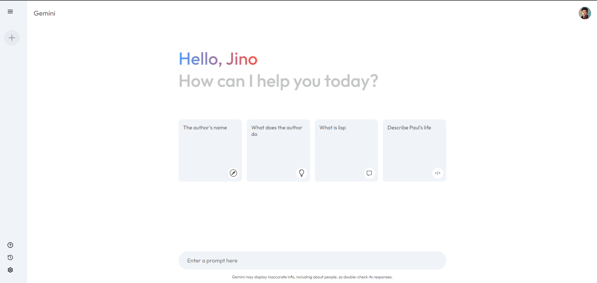
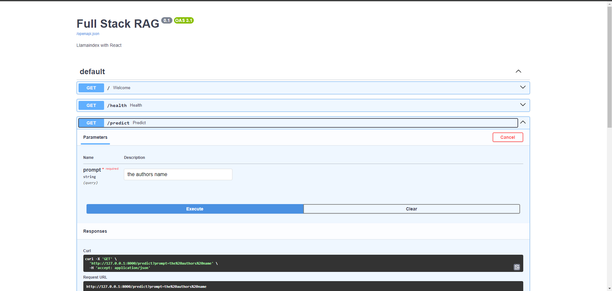

# Full-Stack-RAG

This project shows how to create a Full Stack RAG using Fastapi as a backend APi and React for the frontend. The framework used is Llamaindex.
I've tried to make the UI similar to the Gemini website.



## Quick Start

1. Setup a virtual environment.

```bash
python -m venv .env
pip install -r requirements.txt
```

2. Activate the env.

```bash
.env\Scripts\activate
```

3. Start the uvicorn server

```
uvicorn main:app
```



4. Start the frontend server

```
npm run dev
```

5. Start asking your questions!
